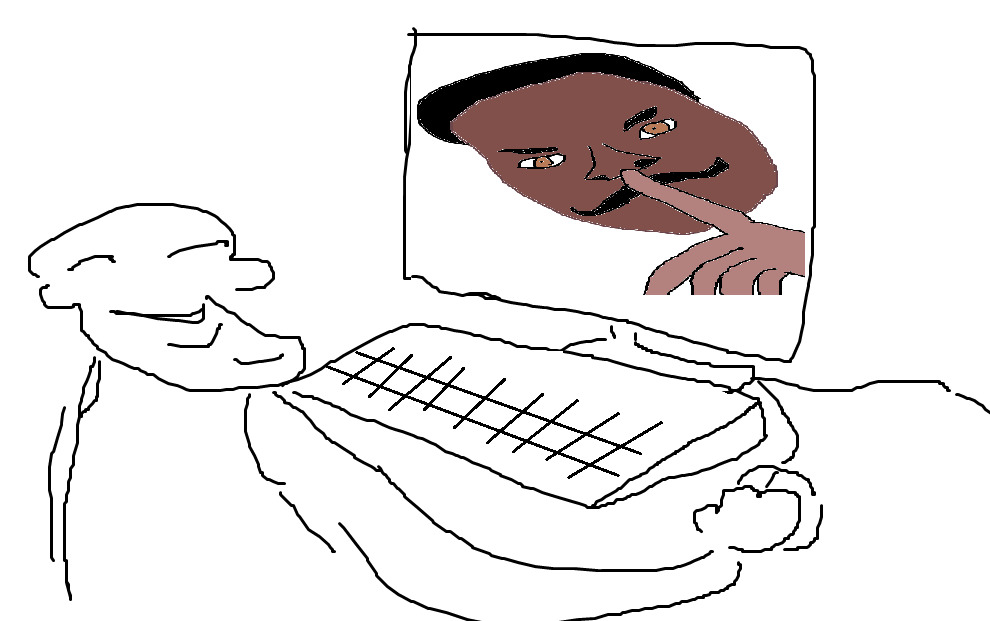

# muzovkantV2
### shitty (half-)vibecoded discord bot
## overall
you can use this as a base for your discord bot by writing your own [cogs](/cogs/), or as is.

## installation
1. clone the repo
```bash
git clone https://github.com/rejnronuzz/muzovkantv2.git
cd muzovkantv2
```
2. install the requirements. you might need to enter a venv on some systems.
```bash
pip install -r requirements.txt
```
3. insert your discord bot token and [thecatapi](https://thecatapi.com) token into the .env file.
*it should look something like this:*
```
DISCORD_TOKEN=abc123abc
CAT_API_KEY=live_abc123abc
```
you can then edit the [config.py](/config.py) to your liking.

## usage
the bot is running when the main.py script is running.

### systemd service
you can configure a systemd service for this bot.
[systemd_service.sh](systemd_service.sh) is ONLY for systemd systems. 

(*tested on Ubuntu 24.04*)

simply do:
```
chmod +x systemd_service.sh
./systemd_service.sh
```
the systemd service will now start and auto start on reboot.

### updating with systemd service
keep in mind that after updating with the systemd service enabled, you will need to restart the service.
so the update workflow looks something like this:
```
git pull origin main
sudo systemctl restart muzovkantv2
```

## contacting
if you have any feedback, contact me on github issues or/and discord. if you want to add any functions to this bot, make a PR.
when submitting a bug report, make sure to attach the bot.log files. they generate automatically in root directory.

*discord: rejnronuz*



